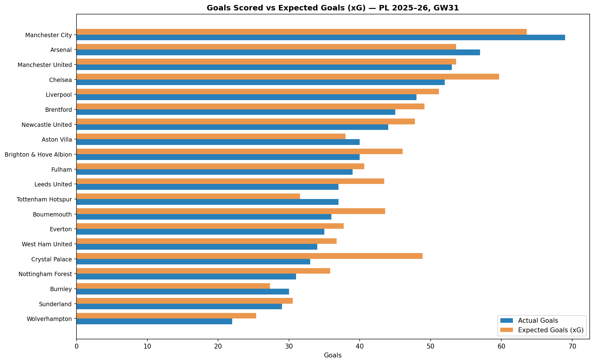
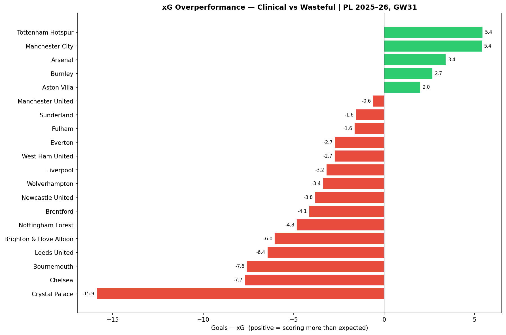
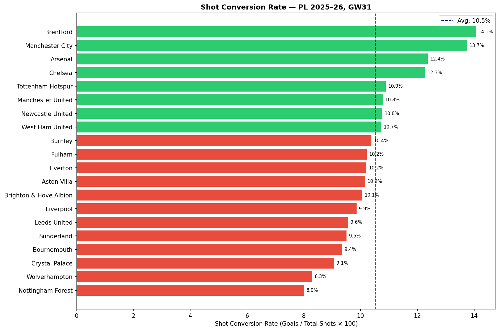
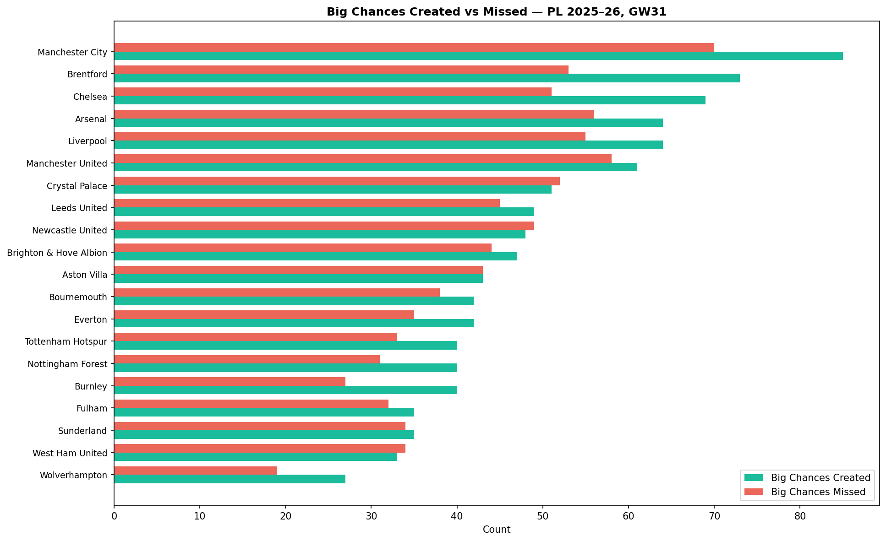
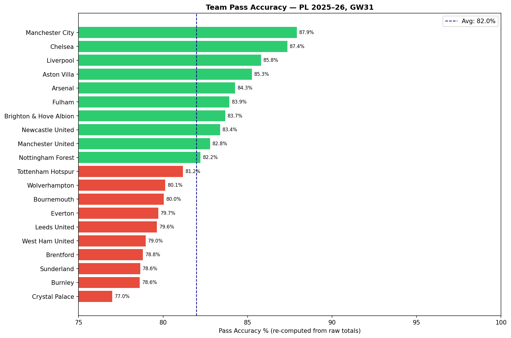
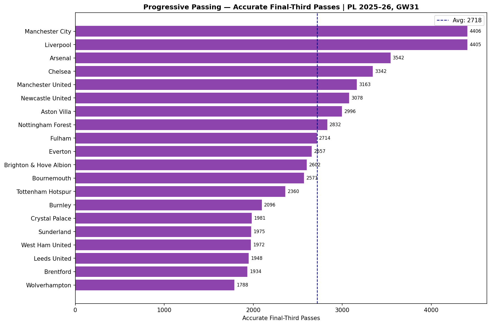
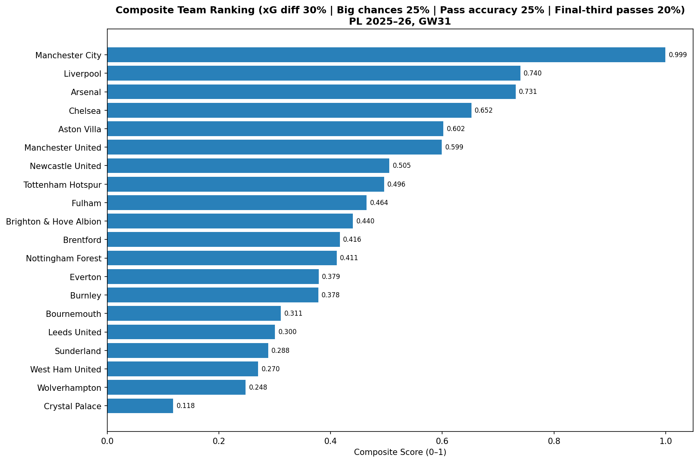

# Premier League Team Performance Analysis 2025–26

Aggregated statistical analysis of all 20 Premier League clubs through Gameday 31 of the 2025–26 season, focused on **attack** (xG vs goals, shot conversion, big chances) and **passing & build-up** (accuracy, progressive passing).

## Charts

### 1. Goals vs Expected Goals (xG)


### 2. xG Overperformance — Clinical vs Wasteful


### 3. Shot Conversion Rate


### 4. Big Chances Created vs Missed


### 5. Pass Accuracy


### 6. Progressive Passing — Final Third


### 7. Composite Team Ranking


## Top 5 — Composite Ranking (GW31)

| Rank | Team | Score |
|------|------|-------|
| 1 | Manchester City | 0.999 |
| 2 | Liverpool | 0.740 |
| 3 | Arsenal | 0.731 |
| 4 | Chelsea | 0.652 |
| 5 | Aston Villa | 0.602 |

## Methodology

The composite score combines 4 min-max normalised (0–1) metrics:

| Metric | Weight | Direction |
|--------|--------|-----------|
| xG Overperformance (Goals − xG) | 30% | Higher = better |
| Big Chances Created | 25% | Higher = better |
| Pass Accuracy (re-computed from raw totals) | 25% | Higher = better |
| Accurate Final-Third Passes | 20% | Higher = better |

> Pass accuracy is re-computed from raw pass totals (`accuratePasses / totalPasses`), not averaged across players, to avoid statistical distortion.

## Data Source

`data/premier_league_stats_gw31.csv` — full player-level stats for all 517 PL players through GW31 of 2025–26. Sourced from Sofascore. Aggregated to team level by summing all player contributions.

## How to Run

```bash
pip install -r requirements.txt
python team_analysis.py
# Charts saved to charts/team/
# Notebook: notebooks/team_analysis.ipynb
```

## Related Analysis

- [Goalkeeper Analysis](README.md) — individual GK performance: save %, goals prevented, composite ranking
